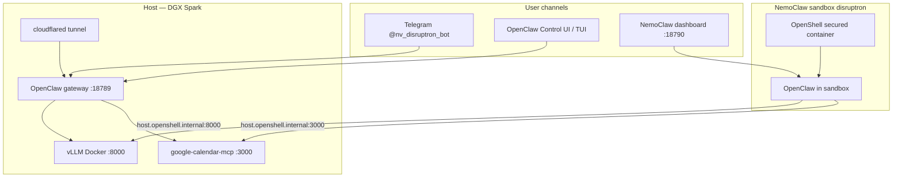

# NV-Disruptron — operations snapshot

**Last updated:** 2026-06-06  
**Host:** DGX Spark (`scan-09`) — GB10, ~121GB unified memory, aarch64, CUDA 13.0  
**Repo:** `/home/nvidia/NV-Disruptron-Gyana`

This document captures **how the stack is configured today** — models, gateways, MCP, channels, token budgeting, and agent prompt engineering. Secrets live in `.env` only (never commit).

---

## Architecture at a glance



| Layer | What | URL / port |
|-------|------|------------|
| **Inference** | Nemotron 3 Nano Omni (NVFP4) via vLLM | `http://127.0.0.1:8000/v1` |
| **Host agent** | OpenClaw gateway, agent `disruptron` | `http://127.0.0.1:18789/` |
| **NemoClaw sandbox** | OpenShell + OpenClaw (same workspace profile) | `http://127.0.0.1:18790/` |
| **Calendar MCP** | `@cocal/google-calendar-mcp` HTTP | `http://127.0.0.1:3000` |
| **Context API** | SQLite recall REST | `http://127.0.0.1:8010/v1/context/` |
| **AI-Q research** (optional) | Deep research sidecar | `http://127.0.0.1:8001` |

---

## Model & inference

| Setting | Value |
|---------|--------|
| **Model (HF / vLLM id)** | `nemotron-3-nano-omni` (hyphenated — required for OpenClaw Nemotron plugin) |
| **Quantization** | NVFP4 (local GGUF alt in `/home/nvidia/unsloth/` — production uses vLLM) |
| **Context window** | **262144 tokens (256k)** — matches `llm_config.max_position_embeddings` |
| **Max output** | 4096 tokens |
| **Multimodal** | `VLLM_MULTIMODAL=1` (text + image + audio) |
| **Reasoning** | vLLM `--reasoning-parser nemotron_v3`; OpenClaw `reasoning: true`, `thinkingDefault: medium` |
| **Docker image** | `vllm/vllm-openai:v0.20.0-aarch64-cu130-ubuntu2404` |
| **GPU util (256k)** | ~0.89, `max-num-seqs=1` (KV cache for full window) |

```bash
./scripts/disruptron vllm              # ensure / recreate container
curl -s http://127.0.0.1:8000/v1/models | jq '.data[0] | {id, max_model_len}'
```

---

## OpenClaw (host gateway)

| Item | Configuration |
|------|----------------|
| **Agent id** | `disruptron` |
| **Workspace** | `features/agent/workspace/` |
| **Primary model** | `vllm/nemotron-3-nano-omni` |
| **MCP servers** | `disruptron_ops` (slim), `google_calendar` (streamable-http → :3000) |
| **Tools allowed** | `message`, `web_fetch`, `browser` (+ MCP) |
| **Heartbeat** | Every 10m (`DISRUPTRON_HEARTBEAT_EVERY`) |
| **TTS** | ElevenLabs when `ELEVENLABS_API_KEY` in `.env` |
| **Telegram** | `@nv_disruptron_bot`, agent binding `disruptron`, `dmPolicy: pairing` |
| **Config file** | `~/.openclaw/openclaw.json` (patched by `./scripts/disruptron configure`) |

```bash
./scripts/disruptron configure [--channels]
openclaw gateway restart
openclaw channels status
openclaw mcp list
```

---

## NemoClaw sandbox

| Item | Configuration |
|------|----------------|
| **Sandbox name** | `disruptron` |
| **Provider** | `vllm-local` → host `:8000` |
| **Dashboard** | `:18790` (host gateway uses `:18789`) |
| **GPU** | Sandbox GPU enabled |
| **Reasoning** | `NEMOCLAW_REASONING=true` at rebuild |
| **Policies** | npm, pypi, huggingface, brew, local-inference, openclaw-pricing, telegram, **google-calendar-mcp** |
| **Telegram** | Channel registered in sandbox; egress + optional cloudflared tunnel |
| **Calendar MCP in sandbox** | `google_calendar` → `http://host.openshell.internal:3000` |

```bash
./scripts/disruptron nemoclaw onboard          # full setup
./scripts/disruptron nemoclaw recover          # restart gateway + calendar MCP
./scripts/disruptron nemoclaw policy-setup --tunnel
./scripts/disruptron nemoclaw url              # dashboard + token
./scripts/disruptron nemoclaw status
```

Docs: [NEMOCLAW.md](NEMOCLAW.md) · [Spark policy setup](https://build.nvidia.com/spark/nemoclaw-applications/policy-setup)

---

## Google Calendar MCP

| Item | Path / detail |
|------|----------------|
| **Source** | `~/google-calendar-mcp` (`@cocal/google-calendar-mcp`) |
| **OAuth tokens** | `~/.config/google-calendar-mcp/tokens.json` |
| **HTTP server** | `node build/index.js --transport http --port 3000 --host 0.0.0.0` |
| **Auto-start** | `./scripts/disruptron nemoclaw recover` and `./scripts/disruptron configure` |
| **OpenShell policy** | `platform/nemoclaw/policies/google-calendar-mcp.yaml` |
| **MCP tools** | `google_calendar__list-events`, `get-freebusy`, etc. (timing only — no event titles in voice) |

```bash
./scripts/disruptron calendar status
./scripts/disruptron calendar ensure
```

---

## Token budgeting (256k)

Computed from `DISRUPTRON_CONTEXT_WINDOW` via `platform/shared/token_budget.py` and applied by `configure.sh`.

| Knob | Typical value (262144 window) |
|------|-------------------------------|
| `reserveTokens` | ~21k (headroom before auto-compaction) |
| `keepRecentTokens` | ~26k (recent tail in summaries) |
| `memoryFlush.softThresholdTokens` | 8000 |
| `toolResultMaxChars` | 12000 |
| `recall_max_chars` (MCP) | 6000 |
| Compaction trigger | ~241k tokens estimated usage |
| Memory flush trigger | ~233k tokens |

OpenClaw inspect: `/status`, `/context list`, `/context detail`, `/compact`.

```bash
./scripts/disruptron token-budget status
```

Details: [CONTEXT.md](CONTEXT.md)

---

## Agent prompt engineering (workspace)

Bootstrap files injected each session: `AGENTS.md`, `SOUL.md`, `TOOLS.md`, `USER.md`, `HEARTBEAT.md`, `VOICE.md`, `MEMORY.md`.

| Skill | Purpose |
|-------|---------|
| `disruptron-ops` | Default orchestrator — broad London status |
| **`disruptron-investigation`** | Vague inputs → hypothesis-driven multi-tool chains |
| **`disruptron-token-budget`** | Summarize tool JSON, `/compact` under pressure |
| `disruptron-multi-tool-analysis` | 3+ domain comparisons + web_fetch |
| `disruptron-context-memory` | SQLite recall, `store_memory_fact` |
| `disruptron-ev-companion` | EV/charging vs USER.md |
| _(+ tube, roads, spatial, equity, voice, browser, …)_ | See [skills/README.md](../features/agent/workspace/skills/README.md) |

**Investigation output format:** Situation → Impact on user → Evidence (sourced) → Actions → Confidence/gaps.

---

## MCP tools (slim default)

Prefix: `disruptron_ops__*`

| Tool | Start here? |
|------|-------------|
| `get_london_city_briefing` | **Yes — every turn** |
| `recall_conversation_context` | Start of interactive sessions |
| `get_london_traffic_snapshot` | Tube/rail drill-down |
| `get_ev_charge_summary` / `get_parking_and_charging_snapshot` | EV |
| `score_line_disruption_impact` | Equity lens |
| `lookup_ward_by_postcode` / `get_ward_profile` | Spatial |
| `store_memory_fact` | Durable cross-session facts |

Full catalog: [MCP.md](MCP.md) · [TOOLS.md](../features/agent/workspace/TOOLS.md)

---

## Environment (`.env` — gitignored)

| Variable | Purpose |
|----------|---------|
| `VLLM_MAX_MODEL_LEN` / `DISRUPTRON_CONTEXT_WINDOW` | 262144 |
| `VLLM_SERVED_MODEL` | `nemotron-3-nano-omni` |
| `VLLM_MULTIMODAL` | 1 |
| `NEMOCLAW_REASONING` | 1 |
| `ELEVENLABS_API_KEY` | Voice TTS/STT |
| `TELEGRAM_BOT_TOKEN` | Telegram bot (BotFather) |
| `DISRUPTRON_HEARTBEAT_EVERY` | 10m |

Template: `.env.example`

---

## Persistence & memory

| Store | Location |
|-------|----------|
| OpenClaw sessions | `~/.openclaw/agents/disruptron/sessions/` |
| SQLite context DB | `data/disruptron_context.db` |
| Daily agent notes | `features/agent/workspace/memory/YYYY-MM-DD.md` |
| Long-term index | `features/agent/workspace/MEMORY.md` |
| Analysis artifacts | `features/agent/workspace/analysis/` |

```bash
./scripts/disruptron context sync
./scripts/disruptron context recall browser main
```

---

## Daily operator commands

```bash
# Full stack health
./scripts/disruptron monitor
./scripts/disruptron validate

# Inference + config
./scripts/disruptron vllm
./scripts/disruptron configure
openclaw gateway restart

# NemoClaw + calendar
./scripts/disruptron nemoclaw recover
./scripts/disruptron calendar status

# Token budget
./scripts/disruptron token-budget status

# Interactive
./scripts/disruptron run
./scripts/disruptron nemoclaw url
```

---

## Related docs

| Doc | Topic |
|-----|--------|
| [CONTEXT.md](CONTEXT.md) | Context window, compaction, pruning |
| [NEMOCLAW.md](NEMOCLAW.md) | Sandbox onboard, policies, tunnel |
| [ARCHITECTURE.md](ARCHITECTURE.md) | System design |
| [QUICKSTART.md](QUICKSTART.md) | Fast demo path |
| [CHANNELS.md](../features/agent/docs/CHANNELS.md) | Telegram + push API |
